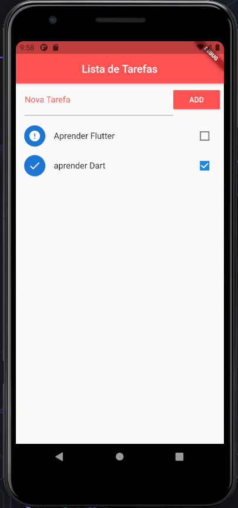

# Sobre o app
Esse app é um simple To Do List, cuja sua função é armazenar quais são a suas tarefas que precisam ser feitas, 
o app também conta com campo de seleção para marcar se sua tarefa que está pendente o se já foi realizada.

## O que aprendi 
Este app foi desenvolvido com intuito de aprendizagem na linguagem Flutter 

Com ele conseguir aprender:

*Ler e Escrever arquivos Json pelo Dart;

*Como armazenar informações fixamente no proprio app;

*Como recumperar uma informação deletada;

*A ultilização do SnackBar para criar uma ação de recuperar os dados deletados;

*Ordenação dos elementos em tela baseado em um Status específico 

## Exemplo de funcionamento do APP

Clique no Link abaixo para ver o vidéo de demostração https://youtu.be/9QdDb6G6vYU

